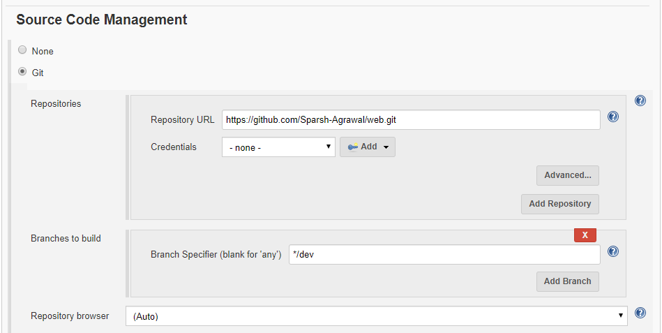
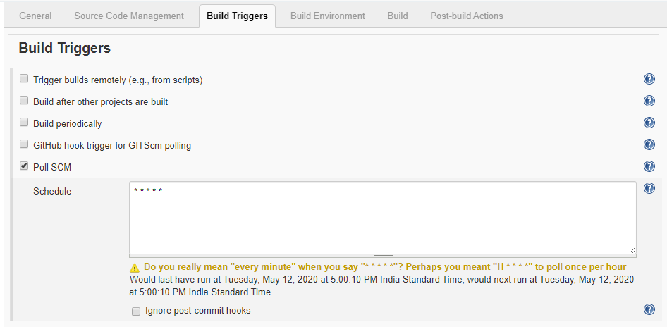
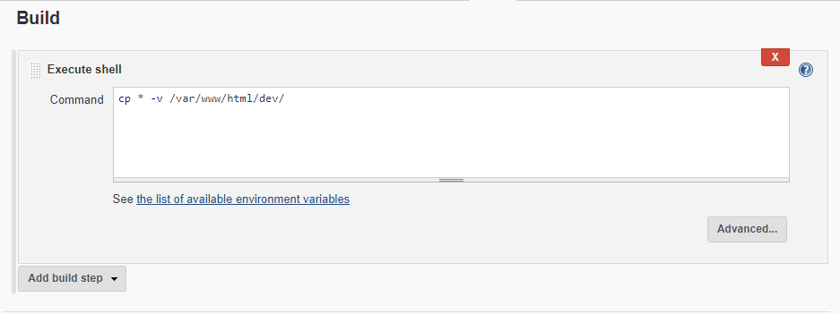
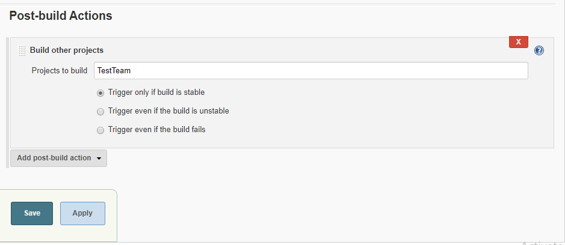
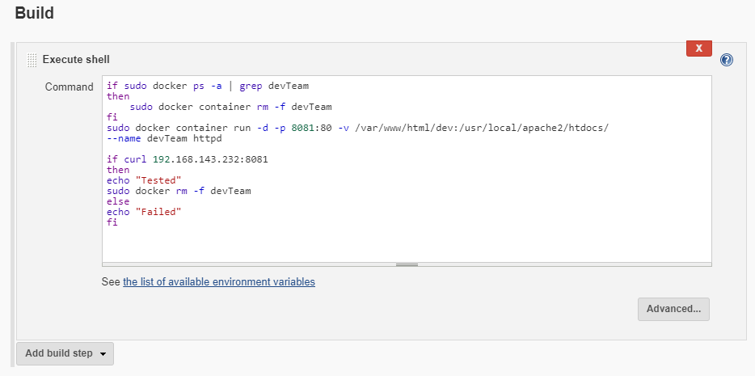
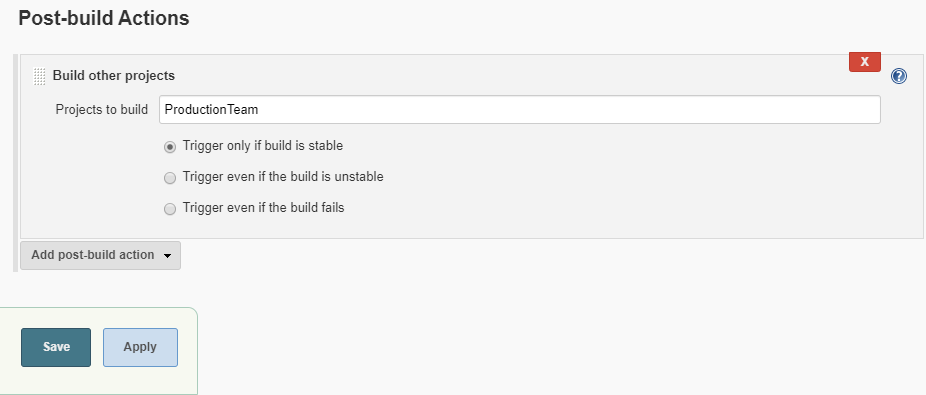

# Automation_of_Deployment
End to end automation and for this I have created three JOBS in Jenkins *DevTeam*, *TestTeam*, *ProductionTeam*.

### DevTeam
The work of Dev Team is to update website using Git and then to push it on GitHub in `dev` branch.
And the Jenkins Job *DevTeam* will continously looking at the Repo using Triggers, at any updation in the repo it will copy the content of the repo to the specified location.
And at last it will fire up the Jenkins job *TestTeam*.

* In the **Source Code Management**, you have to give your Repo URL,

* For **Build Triggers**, select Poll SCM,

* For copying the content of Repo, **Execute a shell**

* For building *TestTeam Job* , select **Build other Projects**

### TestTeam
The work of the test team to test the update on a working environment before deploying to production environment.
So the test team will deploy a container on docker and test the updates.
If there are no problems then it will notify the Production Team.
And at last it will fire up the Jenkins job *ProductionTeam*.

* Running a **docker container**,

* For building *ProductionTeam Job* , select **Build other Projects**

### ProductionTeam
The work of production team is to deploy the updates on production environment.
So the production team will merge the `dev` branch to `master` branch in GitHub.
And it will launch the docker container with those updates.
